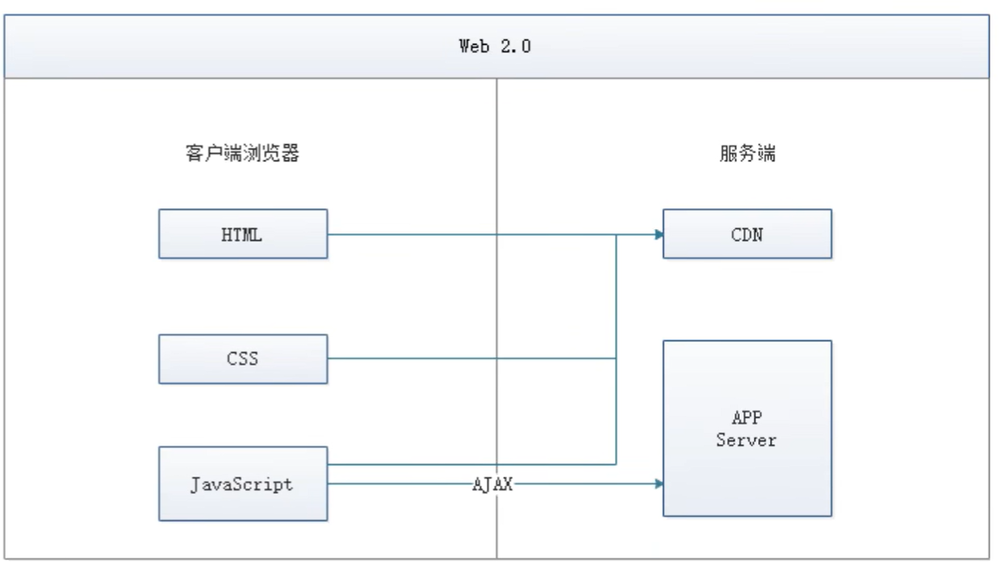
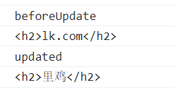
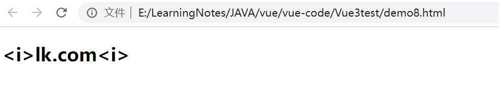
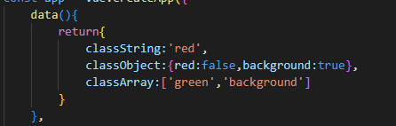
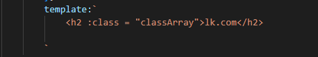
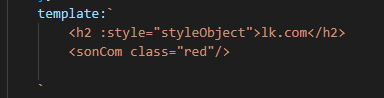
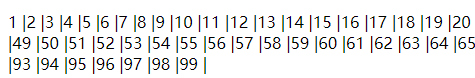
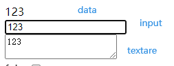
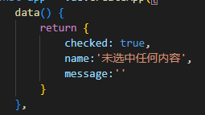

# vue


**渐进式**：逐步实现新特性，慢慢实现模块化开发、路由、状态管理等新特性。综合了Angular（模块化）和React（虚拟DOM）的优点


Axios：前端通信框架，因为vue就是只关注视图层，为了处理DOM，不具备通信能力，就需要额外使用一个通信框架和服务器交互。当然也可以直接选择JQuery提供的AJAX通信功能


## UI框架

Ant-design ： 阿里巴巴出品，基于React的UI框架

ElementUI、iview、ice ： 饿了么出品，基于Vue的UI框架

Bootstrap：Twitter推出的一个用于前端开发的开源工具包

AmazeUI ： HTML5跨屏前端框架

## JavaScript构架工具

Banel： JS编译工具，主要用于浏览器不支持的ES新特性，比如用于编译TypeScript

WebPack： 模块打包器，主要用来打包、压缩、合并及按序加载


## 前后端分离史


MVC是一个不错的协作模式，能够有效的降低代码的耦合度，从架构上能够让开发者明白代码模块。为了使View更加纯粹，还可以使用Thymeleaf、Freemarker等模板引擎，使模板里无法写入java代码，让前后端分工更加清晰。


**缺点：**


### web1.0

早期的JSP、PHP可以称为web1.0时代


### web2.0

05年AJAX被正式提出并开始使用CDN作为静态资源存储，于是出现了JavaScript火起来的SPA(Single Page Application)单页面应用时代




**优点**：前后端的分工清晰，前后端的关键协作点是Ajax接口。其实和JSP时代差别不大，复杂度从服务器端的JSP里移到了浏览器的JavaScript，浏览器端变得复杂，类似MVC，浏览器端的分层架构开始出现：


**缺点**： 


### 大前端时代

前端为主的MV*时代


后端 轻松了，研究分布式、微服务、大数据...

为了降低前端开发复杂度，涌现了大量的前端框架，如：AngularJS  React  Vue.js   EmberJS

这些框架总的原则是先按类型分层，比如Templates 、Controllers 、Models，然后再在层内做切分


### NodeJS-全栈时代

随着NodeJS的兴起，JavaScript开始有能力运行在服务端，新的研发模式


在这种模式下，前后端职责分明，对于前端，两个UI层各司其职

**Front-end** UI Layer处理浏览器层的展现逻辑。通过CSS渲染样式，通过JavaScript添加交互功能，Html的生成也可以放在这层

**Back-end** UI Layer处理路由、模板、数据获取、Cookie等。通过路由，前端可以自主把控URL Desin，这样无论是单页面应用还是多页面应用，前端都可以自由调控。后端也可以摆脱对展现的强关注，转而可以专心于业务逻辑层的开发


Html： 超文本标记语言，用来写网页的基本结构

CSS： 层叠样式表，用来让页面更加生动好看

JavaScript： 解释性或即时编译型的高级编程语言


## Vue初识

Vue 是 MVVM模式

Model： 模型层，这里表示JavaScript对象

View： 视图层，这里表示DOM （HTML操作的元素）

ViewModel ： 连接视图和数据的中间件，Vue.js 就是MVVM中的ViewModel层的实现者


在MVVM框架中，是不允许数据和视图直接通信的，只能通过ViewModel来通信

+ ViewModel 能够观察到数据的变化，并对视图对应的内容进行更新
+ ViewModel能够监听到视图的变化，并能够通知数据发生改变


MVVM 实现了视图View和模型Model的分离


vue.js 就是一个MVVM的实现者，核心就是实现了DOM监听和数据绑定


### Hello Vue

使用VScode编写Vue项目

**编译器打开本地创建的VueTest文件夹，新建一个index.html，**


打开index.html后，直接输入html，直接选择html:5 会自动生成html的基本结构，也可以输入一个感叹号 ！，一样的直接生成html基本结构

引入vue3.x的源码

官方提供直接引入CDN的服务地址，只要用<script>标签 ，就可以直接引入Vue3，（学习期间暂时不需要使用vue-cli、webpack或Vite这些构建工具来构建项目）

```html
<script src="https://unpkg.com/vue@next"></script>
```


**引入框架后，就可以写Vue的代码了**

```html
<!DOCTYPE html>
<html lang="en">
<head>
    <meta charset="UTF-8">
    <meta http-equiv="X-UA-Compatible" content="IE=edge">
    <meta name="viewport" content="width=device-width, initial-scale=1.0">
    <title>Document</title>
    <script src="https://unpkg.com/vue@next"></script>
</head>
<body>
    <div id = "app"></div>
</body>
<script>
    Vue.createApp({ //创建一个Vue实例
        template:'<div>Hello Vue</div>'
    }).mount("#app")
</script>
</html>
```


打开index.html文件，显示测试结果  “Hello Vue”


### 计数器

特性：不改变DOM，面向数据编程，数据传到DOM中

```html
<!DOCTYPE html>
<html lang="en">
<head>
    <meta charset="UTF-8">
    <meta http-equiv="X-UA-Compatible" content="IE=edge">
    <meta name="viewport" content="width=device-width, initial-scale=1.0">
    <title>Document</title>
    <script src="https://unpkg.com/vue@next"></script>
</head>
<body>
    <div id="app"></div>
    
</body>
<script>
    Vue.createApp({
        data(){
            return{
                counter:1
            }
        },
        mounted(){
            setInterval(()=>{
                this.counter += 1
                //this.$data.counter +=1
            },1000)

        },
        template:'<div>{{counter}}</div>' //字面量
    }).mount("#app")
</script>
</html>
```


### 欢迎语

method() 中声明方法

v-on 点击响应事件

v-if 如果为false DOM值就不显示， 

没有改变DOM，修改数据，传到DOM，来改变显示内容

```html
<!DOCTYPE html>
<html lang="en">
<head>
    <meta charset="UTF-8">
    <meta http-equiv="X-UA-Compatible" content="IE=edge">
    <meta name="viewport" content="width=device-width, initial-scale=1.0">
    <title>Document</title>
    <script src="https://unpkg.com/vue@next"></script>
</head>
<body>
    <div id = "app"></div>
</body>
<script>
    Vue.createApp({ //创建一个Vue实例
        data(){
            return{
                content:"",
                setMeal:'真空套餐 帝王套餐 夏日套餐',
                isShowMeal:false
            }
        },
        methods:{
            welcomeBtnClick(){
                this.content="欢迎光临"
            },
            byeBtnClick(){
                this.content="走好不送"
            },
            showOrHideBtnClick(){
                this.isShowMeal = !this.isShowMeal
            }
        },
        //&nbsp分开按钮
        template:`
            <div>
            <div>{{content}}</div>
            <button v-on:click="welcomeBtnClick">有顾客来</button>&nbsp; 
            <button v-on:click="byeBtnClick">有顾客走</button>
            <div>
                <div v-if="isShowMeal">{{setMeal}}</div>
                <button v-on:click="showOrHideBtnClick">显示/隐藏套餐</button>
            </div>
            </div>
        `
        
    }).mount("#app")
</script>
</html>
```


### 循环和数据双向绑定

```html
<!DOCTYPE html>
<html lang="en">
<head>
    <meta charset="UTF-8">
    <meta http-equiv="X-UA-Compatible" content="IE=edge">
    <meta name="viewport" content="width=device-width, initial-scale=1.0">
    <title>佳丽列表</title>
    <script src="https://unpkg.com/vue@next"></script>
</head>
<body>
    <div id = "app"></div>
</body>
<script>
    Vue.createApp({ //创建一个Vue实例
        data(){
            return{
                list:[],
                inputValue:''
            }
        },
        methods:{
            handleAddItem(){
                this.list.push(this.inputValue)
                this.inputValue=''
            }
        },

        template:`
            <div>
                <input v-model="inputValue">
                <button v-on:click="handleAddItem">增加佳丽</button>
                <ul>
                    <li v-for= "(item,index) of list">[{{index}}]{{item}}</li>
                </ul>
            </div>
        `
    }).mount("#app")
</script>
</html>
```


### 组件化开发

```html
<!DOCTYPE html>
<html lang="en">
<head>
    <meta charset="UTF-8">
    <meta http-equiv="X-UA-Compatible" content="IE=edge">
    <meta name="viewport" content="width=device-width, initial-scale=1.0">
    <title>佳丽列表</title>
    <script src="https://unpkg.com/vue@next"></script>
</head>
<body>
    <div id = "app"></div>
</body>
<script>
    const app = Vue.createApp({ //创建一个Vue实例
        data(){
            return{
                list:[],
                inputValue:''
            }
        },
        methods:{
            handleAddItem(){
                this.list.push(this.inputValue)
                this.inputValue=''
            }
        },

        template:`
            <div>
                <my-title />
                <input v-model="inputValue">
                <button v-on:click="handleAddItem">增加佳丽</button>
                <ul>
                    <my-jiali
                        v-for="(item,index) of list"
                        v-bind:item = "item"
                        v-bind:index = "index"
                    />
                </ul>
            </div>
        `
    })
    //静态组件
    app.component('my-title',{
        template:'<h1 style="text-align:center">象牙山洗脚城</h1>'
    })
    //动态组件
    app.component('my-jiali',{
        props:['index','item'],
        template:`<li>[{{index}}]-{{item}}</li>`
    })
    app.mount("#app")
</script>
</html>
```


<script> 标签内第一行 声明一个变量 “app”，声明过后就可以把 **mount** 部分独立出来了

```html
const app = Vue.createApp({ //创建一个Vue实例
	//...
app.mount("#app")
```

有了app变量，可以非常方便的自定义组件并使用了。比如写一个关于标题的静态组件

```html
//静态组件
app.component('my-title',{
template:'<h1 style="text-align:center">象牙山洗脚城</h1>'
})
```

将这个定义的组件 **'my-title'** 使用在app的模板部分，比如放在template的最上面，


页面效果如下：


#### 动态组件

所谓动态组件，就是指显示内容不固定，通过父组件或者程序控制而输出的内容


```html
//动态组件
app.component('my-jiali',{
props:['index','item'],
template:`<li>[{{index}}]-{{item}}</li>`
})
```

这个组件会绑定一些**props**，用于接受父组件传递过来的参数，然后动态显示出内容。

动态组件有一个关键的指令是v-bind，用这种方法，组件可以通过**props**取得对应的值


## 基础部分

### creatApp( ) & mount( )

```html
const app = Vue.createApp({ })
app.mount("#app")
```

Vue.createApp( ) , 创建一个Vue的应用


mount( )方法

mount( )方法就是挂载到某个html的DOM节点上，接受一个字符串型参数，参数可以使用CSS选择器，一般都是ID选择器的i形式，指定挂载的DOM元素


+ createApp( ) 基本参数详解

首先该方法接受一个对象形式的参数 **{ }**，这个对象告诉Vue应该如何展示最外层的组件。

```html
<!DOCTYPE html>
<html lang="en">
<head>
    <meta charset="UTF-8">
    <meta http-equiv="X-UA-Compatible" content="IE=edge">
    <meta name="viewport" content="width=device-width, initial-scale=1.0">
    <title>Document</title>
    <script src="https://unpkg.com/vue@next"></script>
</head>
<body>
    <div id = "app"></div>
</body>
<script>
    const app = Vue.createApp({ 
        data(){
            return{
                message:'lk.com' //在这里定义了一个数据 Model
            }
        },
        template:"<h2>{{message}}</h2>"  //模板  View
        // 定义后，View自动关联，vm
    }) //创建一个Vue实例
    const vm = app.mount("#app")
    console.log(vm)  
</script>
</html>
```


当使用了createApp( )方法创建了一个Vue应用时，如何获取根组件？

实际上使用mount( )方法时，就会返回跟组件，可以声明一个变量来获取根组件，并打印出来，通过打印可以看出根组件是一个proxy形式的对象

```
const vm = app.mount("#app")
console.log(vm)
```


### mvvm设计模式

Vue的编程设计模式为MVVM的设计模式，

+ M: model 代表数据
+ V：View 视图，模板

+ VM： viewmodel视图数据连接层


model数据是我们自己定义的，view模板也是我们自己定义的，但是vm是Vue自动给我们关联的


### 生命周期函数

### 


```html
<!DOCTYPE html>
<html lang="en">
<head>
    <meta charset="UTF-8">
    <meta http-equiv="X-UA-Compatible" content="IE=edge">
    <meta name="viewport" content="width=device-width, initial-scale=1.0">
    <title>Document</title>
    <script src="https://unpkg.com/vue@next"></script>
</head>
<body>
    <div id = "app"></div>
</body>

<script>
    // 生命周期函数，在某一时刻会自动执行的函数
    const app = Vue.createApp({ 
        data(){
            return{
                message:'lk.com' 
            }
        },
        methods:{
            handleItemClick(){
                this.message = this.message == 'lk.com'?'里鸡':'lk.com'
            }
        },
        beforeCreate(){ //在实例声明前执行的函数
            console.log('beforeCreate')
        },
        created(){  //在实例生成之后会自动执行的函数
            console.log('created')
        },
        beforeMount(){ //在模板渲染完成之前执行
            console.log('beforeMount')
        },
        mounted(){  //在模板渲染完成之后
            console.log('mounted')
        },
        beforeUpdate(){ //当data中数据变化时，会立即自动执行的函数
            console.log('beforeUpdate')
            console.log(document.getElementById('app').innerHTML)
        },
        updated(){  //当data中数据变化时，页面重新渲染完成后，会立即自动执行的函数
            console.log('updated')
            console.log(document.getElementById('app').innerHTML)
        },
        beforeUnmount(){  //当Vue应用失效时，会自动执行的函数
            console.log('beforeUnmount')
            console.log(document.getElementById('app').innerHTML)
        },
        unmounted(){ //当Vue应用失效时，且DOM完全销毁之后，会自动执行的函数
            console.log('unmounted')
            console.log(document.getElementById('app').innerHTML)
        },

        template:"<h2 v-on:click='handleItemClick'>{{message}}</h2>"  
    }) //创建一个Vue实例
    const vm = app.mount("#app")
    console.log('vm')
</script>
</html>
```


测试效果


==beforeUpdate和updated生命周期函数==

这两个生命周期函数在Vue中data数据发生变化时，才会被执行，一个是在变化之前，一个是在变化之后。

为了能展示这个效果，写了一个数据变化的功能，每次点击文字都进行改变，在之前编写的`handleItemClick`方法中，改变 `message` 的值。使用了三元运算符：

```html
handleItemClick(){
                this.message = this.message == 'lk.com'?'里鸡':'lk.com'
            }
```


通过如下方式编写测试函数

```html
beforeUpdate(){ //当data中数据变化时，会立即自动执行的函数
            console.log('beforeUpdate')
            console.log(document.getElementById('app').innerHTML)
        },
        updated(){  //当data中数据变化时，页面重新渲染完成后，会立即自动执行的函数
            console.log('updated')
            console.log(document.getElementById('app').innerHTML)
        },
```



通过结果可以看出，在`beforeUpdate`时，DOM的内容并没有渲染更新，而到了`updated`中DOM内容已经进行了更新。


==beforeUnmount和unmounted生命周期函数==

这两个生命周期函数是在Vue销毁时自动执行的函数，一个是销毁前执行，一个是销毁后执行。

- beforeUnmount( ) :当Vue应用失效时，会自动执行的函数
- unmounted() : 当Vue应用失效时，且DOM完全销毁之后，会自动执行

我们可以先把这两个生命周期函数写在页面上，代码如下：


为了能够看到效果，需要在浏览器的控制台中输入销毁代码


在 `beforeUnmount`方法中还是有DOM内容的，然后到了 `unmounted`方法中，就已经没有DOM内容了


#### 总结

- beforeCreate( ) ：在实例生成之前会自动执行的函数
- created( ) : 在实例生成之后会自动执行的函数
- beforeMount( ) : 在模板渲染完成之前执行的函数
- mounted( ) : 在模板渲染完成之后执行的函数
- beforeUpdate ：当data中的数据变化时， 会立即自动执行的函数
- updated：当data中的数据发生变化，页面重新渲染完后，会自动执行的函数
- beforeUnmount( ) :当Vue应用失效时，会自动执行的函数
- unmounted() : 当Vue应用失效时，且DOM完全销毁之后，会自动执行

这些生命周期虽然多，你可以成对的去记忆，这样就有四个关键节点了：创建、渲染、更新、销毁。最主要的理解是他们是**自动执行的函数**


### 插值表达式

之前提到的字面量，其实正确叫法就是  插值表达式，

大部分还是叫字面量，就是我们经常看到的 {{xxxx}} 这样的东西

上个demo把生命周期相关内容删除，

留下的template属性中的 {{message}}就是插值表达式，意味着用这种形式，可以使用data中的变量展示在模板中


==插值表达式输出html标签==


**v-html**指令

如果我想在变量里编写一些html的标签，然后输出展现在页面中，如下

在message中加入 <i> 标签


其他什么都不做 直接输出，在浏览器中看到的就是




为了解决这一问题，需要使用`v-html` 标签解决，把template属性的部分改成


```html
<!DOCTYPE html>
<html lang="en">
<head>
    <meta charset="UTF-8">
    <meta http-equiv="X-UA-Compatible" content="IE=edge">
    <meta name="viewport" content="width=device-width, initial-scale=1.0">
    <title>Document</title>
    <script src="https://unpkg.com/vue@next"></script>
</head>
<body>
    <div id = "app"></div>
</body>

<script>
    const app = Vue.createApp({ 
        data(){
            return{
                message:'<i>lk.com<i>' 
            }
        },
        methods:{
            handleItemClick(){
                this.message = this.message == 'lk.com'?'里鸡':'lk.com'
            }
        },


        template:`<h2
                        v-on:click='handleItemClick'
                        v-html="message"
                        v-once
                ></h2>` 
    }) //创建一个Vue实例
    const vm = app.mount("#app")
    
</script>
</html>
```


预览效果


==v-once==标签 插值表达式 只作一次渲染


现在这种插值表达式，是跟着data中的数据一起变化的，也就是常说的数据双向绑定。如果我希望一个插值表达式，只有在第一次渲染取data中的值，而以后不再跟随data变化，这时候就要用到 `v-once`指令

```html
template: `<h2 v-on:click="handleItemClick" v-html="message"> </h2>`
```


这时，每点击一次h2标签， `message`的值都是变化的。再改一下代码

```html
template: `<h2 
                v-on:click="handleItemClick" 
                v-html="message"
                v-once
            > </h2>`
```

加入了 `v-once`后，无论data中的数据如何变化，模板也不会再次重新渲染了


==插值表达式中可以使用JS表达式==

最常用的表达式是三元运算符。比如，在data中新声明一个变量`count`，用三元运算符判断是否大于2


也可以使用代码下面一些简单的表达式

==v-bind==

如果给h2标签加入一个title属性，属性的值也想使用`message`。 代码如下


这时浏览器中鼠标放上时显示的是 `message`这个单词，并没有出现我们想要的结果，可以使用v-bind标签，如下


这时鼠标放在浏览器消息上，显示的就是data中message的值`lk.com`了


v-bind 简写方法，v-bind可以省去 只写一个冒号 `:` 

`v-on:`同样也有简写方法 ：只需用@替换即可


### 模板动态参数

现在绑定的事件 `click`和 `title`都是固定死的，Vue也提供了动态参数，叫做动态属性的功能。

比如上面的 `title` 是来自 `data`中的，可以这样写：

```html
const app = Vue.createApp({ 
        data(){
            return{
                message:'lk.com' ,
                name:'title'          
            }
        },
....
        template:`

                  <h2 

                  :[name] = "message"
                  @click = "handleItemClick"

                  >
                  {{message}}
                  </h2>                
        ` 
    }) //创建一个Vue实例
```


在`data`中，定义了一个name的变量，值是一个字符串，然后再绑定属性时，使用了 `[]`方括号加上data中变量名的形式。这时候绑定的属性就变得灵活了，这种形式就是模板动态参数，


如果要修改，如  `name:'title'`修改为 `name:'title1'`，网页端通过检查的范式，可以看到浏览器中也会跟随改变，形成动态效果


==事件动态绑定==

动态绑定也可以用到`v-on`事件绑定当中，比如在`data`中声明一个`event`的变量，然后给他一个 `click`，然后在模板中同样方法实现事件动态绑定

```html
const app = Vue.createApp({ 
        data(){
            return{
                message:'lk.com' ,
                name:'title',
                event:'click'
            }
        },
        methods:{
            handleItemClick(){
                alert('lk.com')
            },
            handleButton(){
                alert('lkkk')
            }
        },


        template:`

                  <h2 

                  :[name] = "message"
                  @[event] = "handleItemClick"

                  >
                  {{message}}
                  </h2>

        ` 
    }) //创建一个Vue实例
```


测试，浏览器中点击 `<h2>`标签时，也会弹出相应的alert效果。当改变data中event的值时，如将`event:'click'`修改为`event:'mouseenter'`，实现修改点击事件为鼠标滑动事件，触发相应的弹出效果


### 阻止默认事件

最常见的默认事件就是表单的默认提交事件，比如，写一个属性为`submit`的按钮，当点击按钮时，表单就会默认提交到对应的网址

```html
<form action="https://jspang.com">
    <button type="submit">默认提交</button>
</form>
```

打开浏览器，点击”默认提交“按钮，就会立即跳转到 https://jspang.com 页面上去，这就是==默认响应事件==。但在开发中经常需要阻止这种默认响应事件，比如：

```html
methods:{
    hanldeClick(){
        alert('lkkkk')
    },
    hanldeButton(e){
        e.preventDefault()
    }
},
//...
template:`
      //....
<form action="https://jspang.com" @click="hanldeButton">
    <button type="submit">默认提交</button>
</form>
`
```

这样写，引入一个阻止默认事件的方法，每次写就比较麻烦，Vue给提供了一个模板修饰符，直接可以阻止默认行为

```
<form action="https://jspang.com" @click.prevent="handleButton">
<button type="submit">submit</button>

</form>
```


### 模板中的条件判断

模板中使用条件判断，控制页面的样式，是最常见的应用。Vue提供了两种基本的方法，一种是之前用过的三元运算符，另一种就是 `v-if`

==三元运算符进行判断==

```html
<script>
    const app = Vue.createApp({ 
        data(){
            return{
                message:'lk.com' ,
                
            }
        },
        methods:{
            handleItemClick(){
                this.message = this.message == 'lk.com'?'里鸡':'lk.com'
            }
        },

//三元运算符形式进行判断
        template:`
                  <h2 :class="message == 'lk.com'?'one':'two'"
                  @click = "handleItemClick"
                  >
                    {{message}}
                  </h2>
        ` 
    }) //创建一个Vue实例
    const vm = app.mount("#app")
    
</script>
<style>
    .one{color: brown;}
    .two{color: chartreuse;}
    .three{color: coral;}
</style>
</html>
```


==v-if判断==

三元运算符的限制还是比较明显的，就是只能判断两个值，如果这时候再加入一个值，想要它显示橙色，这时三元运算符就满足不了需求了。

这里使用`v-if`判断


编写模板

```html
 template:`
<h2 @click = "handleItemClick" v-if= "message == 'lk.com'" class= "one">{{message}}</h2>
<h2 @click = "handleItemClick" v-if= "message == '里鸡'" class = "two">{{message}}</h2>
<h2 @click = "handleItemClick" v-if= "message == 'bilibili'" class = "three">{{message}}</h2>
        ` 
```

当然也可以使用v-else，如

```html
 template:`
<h2 @click = "handleItemClick" v-if= "message == 'lk.com'" class= "one">{{message}}</h2>
<h2 @click = "handleItemClick" v-else class = "two">{{message}}</h2>
        ` 
```


### 计算属性

计算属性的特性：**当计算属性依赖的内容发生变更时，才会重新执行计算。**

在data中声明两个变量： **price**和**count**


在template中打印两个变量乘积的结果

```html
template:` <h2> {{price * count}}</h2>`
```

打开浏览器显示结果 40 ，这种做法当然可以，但不够优雅，也没有语义化，如果想进行语义化，可能想到的第一个办法就是写一个getToal的方法


```html
template:` <h2> {{getTotal()}}</h2>`
```

此时，如果通过页面console改变页面的message值，即message值被重新渲染了，这个方法其实也会被重新执行（可以将getTotal方法返回一个时间戳，改变message，时间戳的值也会随之改变）


使用`comuputed`计算属性来传递值，起名叫**total( )**


修改`template`中 获取计算总价的参数

```html
template:` 
    <h2>{{message}}</h2>
    <h2> {{total}}</h2>
`
```

这时到浏览器中，手动修改 `message`的值，total的值就不会改变，使用时间戳进行测试也不会改变

以上可以得出总结：

1. **方法methods：只要页面重新渲染，就会重新执行方法**
2. **计算属性computed: 当计算属性依赖的内容发生变更时，才会重新执行计算**


==改变计算属性==

```html
<!DOCTYPE html>
<html lang="en">
<head>
    <meta charset="UTF-8">
    <meta http-equiv="X-UA-Compatible" content="IE=edge">
    <meta name="viewport" content="width=device-width, initial-scale=1.0">
    <title>Document</title>
    <script src="https://unpkg.com/vue@next"></script>
</head>
<body>
    <div id = "app"></div>
</body>

<script>
    const app = Vue.createApp({ 
        data(){
            return{
                message:'bilibili' ,
                price:20,
                count:2
        
                
            }
        },
        computed:{
            //计算属性的特性，当计算属性依赖的内容发生改变时，才会重新执行计算
            total(){
                return this.price * this.count
            }
        },
        methods:{
            handleItemClick(){
                this.message = this.message == 'lk.com'?'里鸡':'lk.com'
            },
            //只要页面重新渲染，就会重新执行方法
            getTotal(){
                return this.price * this.count
            },
            addCount(){
                this.count++
            }
        },

        template:`
            <h2>{{message}}</h2>
            <h2>总和：{{total}}</h2>
            <button @click="addCount">再买一个</button>


        ` 
    }) //创建一个Vue实例
    const vm = app.mount("#app")
    
</script>
<style>
    .one{color: brown;}
    .two{color: chartreuse;}
    .three{color: coral;}
</style>
</html>
```


点击**再买一个**按钮，执行addCount方法，增加count，总价增加，按理返回的值也会自动改变，测试显示是这样的


理解计算属性和普通methods方法的区别，明白区别后，做项目时可以清楚知道什么时候该用计算属性，什么时候用vue方法了


### 监听器-watch

可以监听data中的值的变化，做出响应的操作。和计算属性（computed）很像，但仍有一些区别


==监听器的基本写法==

```html
watch:{
    count(){
    	console.log('count changed')
    }
```

改监听器来监听`count`的数据变化，当`count`变化后立即在控制台打印出 `count changed`


监听器中的方法还可以接收两个参数，一个是现在的值，一个是变化前的值

```html
watch:{
    count(current,prev){
        console.log('watch changed')
        console.log('现在的值：',current)
        console.log('变化前的值：',prev)
    }
},
```


注意两个参数的先后顺序


==**侦听器和计算属性的区别**==

计算属性也是可以根据变化执行一些操作的，那二者有何区别

先给出结论，计算属性computed必须要返回一个值，而且在页面渲染的同时就会执行里边的业务逻辑，也就是会先执行一遍你写的业务逻辑，而`watch`只有发生变化时才会执行，也就是说值没有变化，它是不执行里边业务逻辑的。为了验证结果，先注释掉侦听器watch相关的内容，在计算属性`total`中写这样的代码。


```html
computed:{
    total(){
        console.log('....count changed')
        return this.price * this.count
    }
},
```


此时数据没发生变化，watch没有执行

数据发生变化后


**另外，计算数学更加简洁**

再来思考一个问题，用watch侦听器，可以写出类似计算属性的代码吗？答案是肯定的。现在我们就就写一个类似计算属性效果。

先在data中声明一个新的变量，叫做`newTotal`，给出一个`40`的值。


然后修改watch中代码，写一个乘法表达式算出`总和`，赋值给`this.newTotal`


最后把模板中的渲染值，改为`newTotal`就可以了


写完这些，你在浏览器中看到的效果和计算是属性是一样的。但是从代码简洁性上，显然侦听器的写法是麻烦并冗余，所以建议优先使用计算属性来完成同样的操作。


==method、watch和computed三者使用优先级==

如果三者都能实现相同的功能

- `computed` 和 `method`都能实现的功能，建议使用computed,因为有缓存，不用渲染页面就刷新。
- `computed` 和 `watch` 都能实现的功能，建议使用 computed，因为更加简洁。


### 模板样式绑定

先写三个基本样式，引入到模板


template传入 lk.com 字符串

可以通过简单的方式 ，直接将字体变色，（和普通的html方法一样）直接写class加上类名就可以了


如果希望程序足够灵活，样式也是可以控制的，这样引入样式的方法就不行了。需要在Data中声明变量，然后在模板 `template` 中进行绑定


声明data变量



分别是 普通声明，对象形式和数组形式，

通过绑定的方式，即可实现




可以在CSS样式中增加`!important`设置样式优先级

如下


字体并没有显示红色，而是绿色


修改 red 对应的优先级后


==子组件的样式绑定==

编写一个子组件 `SonCom`

```html
app.component('sonCom',{
        template:`
                <div>SonCom</div>
        `
    })
```

有了子组件后，就可以在父组件的模板中进行使用了，使用就是直接写一个类似html的标签进去就可以


**如何区分父子组件**

在Vue.createApp( )方法中使用对象形式 `{ }`配置的一般叫做父组件，而下面使用的其他组件，叫做子组件。也可以这么理解，主动调用的是父组件，被调用的是子组件


**子组件添加样式方法**

在调用子组件的地方加上 `class`



也可以在子组件处加上 `class`


子组件使用样式可能遇到的小坑

如果在子组件再添加一个`<div>`进去，

如果在调用子组件的地方修改样式，


会发现，样式不起作用了，

如果让它起作用，只有在两个并列的 `<div>`外层，再加上一个包括性的标签就可以了，也就是说让子组件最外层只有一个根元素


==行内样式的编写==

行内样式就是自己在模板的DOM元素上写CSS样式

```html
<h2 style="color:orange">lk.com</h2>
```

除了这种写法以外，Vue中也为我们扩展了一些内容，让行内样式的写法更直观和令狐。你可以直接在data中编写样式，比如在Data中这样写


然后用绑定行内样式的形式，在模板上进行绑定

```html
 <h2 :style="styleString">lk.com</h2>
```

也可以使用对象的形式在data中编写CSS样式，


然后再进行绑定


### v-show & v-if

之前学习了 `v-if` 和`三元运算符`，`v-show`和`v-if`是很类似的

```html
<!DOCTYPE html>
<html lang="en">
<head>
    <meta charset="UTF-8">
    <meta http-equiv="X-UA-Compatible" content="IE=edge">
    <meta name="viewport" content="width=device-width, initial-scale=1.0">
    <title>Document</title>
    <script src="https://unpkg.com/vue@next"></script>
</head>
<body>
    <div id = "app"></div>
</body>

<script>
    const app = Vue.createApp({ 
        data(){
            return{
                show:false
                }
           
        },
        template:`
            <h2 v-show="show">lk.com</h2>
            <h2 v-if="show">lk.com</h2>        
        ` 
    }) //创建一个Vue实例

    const vm = app.mount("#app")
    
</script>

</html>
```

数据中声明一个show的变量，可以在模板中使用 `v-show`来控制CSS样式，从而控制DOM元素是否显示

```html
<h2 v-show="show">lk.com</h2>
```

打开浏览器，可以看到 lk.com 这个DOM元素不见了，但是在element审查时，是可以看见DOM元素还在的


只是display了而已

但是 使用`v-if`后，


DOM元素直接没有了


==二者区别==

`v-if`**更加灵活**，可以增加多个判断，比如`v-else-iif`和`else`，而`v-show`**不具备这样的灵活性**。

`v-show`控制DOM元素显示，其实控制的是css样式，也就是`display:none`

```html
<h2 style="display:none;">lk.com</h2>
```

用`v-if`进行判断。再次在浏览器中预览，会发现整个DOM元素都不见了。

如何使用他们。这个就要看具体的需求了，如果显示和隐藏的状态切换比较频繁，并且没有什么多余复杂的业务逻辑，建议使用`v-show`,因为他不会一直渲染你的页面DOM元素，这或多或少对性能和稳定性有点提升。反之可以使用`v-if`。


### v-for

==v-for循环数组==

data中声明一个数组 `listArray`

```html
data(){
            return{
                listArray:['谢大脚','刘英','小红'],
                }           
        },
```

在`tmplate`中循环出这些数组

```HTML
<ul>
                <li
                    v-for="(item,index) in listArray"
                    :key="index + item"
                >
                    [{{index}}]{{item}}
                </li>
</ul>    
```


加入索引 index


==循环时的key值==

为了提高循环时性能，在数组其中一项变化后，整个数组不进行全部重新渲染，Vue提供了绑定key值的使用方法，目的就是增加渲染性能，避免重复渲染。

编写出一个按钮，然后每次点击按钮后向数组中增加`push`一个新值。


如果不写 `:key="index + item"` ，当点击按钮时，表面上看只增加了一个新的内容，实际整个列表都被渲染了。在实际工作中，这样的代码是不被允许的，它会降低页面的性能，在数据量变多的时候，用户用起来会变的卡顿。

这时，可以加唯一性`key`值，增加后vue就会辨认出哪些内容被渲染后并没有变化，而只渲染新变化的内容。

官方不建议使用索引`index`为key值，但此时又为了保持唯一性，所以这里使用了`index+item`进行绑定key值


==v-for循环对象==

在`data`中建立一个对象


在`template`中循环

```html
<ul>
                <li
                    v-for="(value,key,index) in listObject"
                    :key="key"
                >
                    [{{index}}]{{key}}:{{value}}
                </li>
            </ul>  
```


`v-for`是可以用来循环数字的，比如要循环1-99的数字

```html
 <span v-for="count in 99"> {{count}} |</span>
```




==v-for中如何使用判断==

如果不想展示谢大脚，只显示刘英和小红，可能会想到这样写


浏览器中浏览 `谢大脚`这一循环项并没有消失，因为`v-for` 的优先级要高于`v-if`，所以 `v-if` 判断失效

正确的写法应该是在 <li> 外层独立出一个标签，在 <li> 上做循环


谢大脚成功消失


==template标签的使用==

上面结果并不完美，打开控制台，看Elements选项卡时，会发现DOM结构有问题，明明只循环出两项，却有3个 `<div>` ,


而且这种外层套用 `<div>` 里边使用 `<li>`的形式，不符合HTML语法的基本结构


VUE给提供了 `tmplate`标签，就是一个空的占位符，目的就是解决模板中为完成业务逻辑，而使用无用的html标签的线性


### 绑定事件详解

#### 方法和参数

新建一个页面

```html
<!DOCTYPE html>
<html lang="en">
<head>
    <meta charset="UTF-8">
    <meta name="viewport" content="width=device-width, initial-scale=1.0">
    <title>Demo19</title>
    <script src="https://unpkg.com/vue@next" ></script>
</head>
<body>
    <div id="app"></div>
</body>
<script>
    const app=Vue.createApp({ 
    data(){
        return{
            count:0
        }
    },
    methods:{},
    template:`
      <div>目前已点佳丽数量{{count}}.</div>
      <button>增加一位佳丽</button>
        ` 
    }) 
    const vm=app.mount("#app")

</script>

</html>
```

在method中写一个方法 `addCountClick()`

```html
methods:{
    addCountClick(){
        this.count++;
    },
},
```

然后在Button上绑定这个响应事件


实现效果，点击按钮，佳丽数量逐个增加


当然，也可以直接使用表达式实现

```html
<button @click="count++">增加一位佳丽</button>
```

如果要实现每次点击增加2个佳丽，就不能直接使用表达式实现，还是需要引入 method


==事件中的event对象==

在编写响应事件时，是可以接受一个event参数的，这个参数就是关于响应事件的一些内容，直接打印出event


可以在浏览器的控制台中看到，内容还是挺多的


可以通过 `event.target` 直观看到是哪个DOM元素触发事件


==单参数/多参数的传递==

比如实现每次点击增加两个

向addCountClick()传入一个num，每次点击实现 count+=num


有参数的情况下使用 `event`


这是传递 `event`需要加上 `$event`


**一个按钮调用两个方法**


这里需要注意的是，调用方法时候，要加上 `()`，方法之间 `,`隔开。如果不加调用时无效的

#### 时间修饰符

绑定事件中的修饰符有很多种，如`stop` `prevent` `capture` `self` `once` `passive`

==通过修饰符解决冒泡事件==

冒泡事件是最常处理的，先手动创造一个冒泡事件

```html
<!DOCTYPE html>
<html lang="en">
<head>
    <meta charset="UTF-8">
    <meta name="viewport" content="width=device-width, initial-scale=1.0">
    <title>Demo20</title>
    <script src="https://unpkg.com/vue@next" ></script>
</head>
<body>
    <div id="app"></div>
</body>
<script>
    const app=Vue.createApp({ 
    data(){
        return{
            count:0
        }
    },
    methods:{
        addCountClick(){
            this.count++

        },
        handleBtnClick1(){
            alert(1)
        }

    },
    
    template:`
    <div @click.self="handleBtnClick1">
      <div>目前已点佳丽数量{{count}}.</div>
      <button @click="addCountClick()">增加一位佳丽</button>
    </div>
        ` 
    }) 
    const vm=app.mount("#app")

</script>

</html>
```

上面代码，

`method`中增加了一个冒泡方法

最外层增加了一个 `<div>` 并添加click事件

形成冒泡效果，就是有嵌套的DOM元素时，两个都有绑定事件，JS会自动向上传递事件

点击按钮或其他空白地方，都会跳出`alert(1)`

==stop==修饰符

在Vue中要停止冒泡是非常简单的，只要加加一个事件修饰符`stop`就可以了


点击按钮不再跳出 弹窗

==self==修饰符

使用`self`修饰符，意思是只有点击自己的时候才会被执行，加的时候要加在外层DOM元素的事件上


这时候会发现点击无论点哪里，都没办法触发`hanldeBtnClick1`方法了，这是因为目前最外层div下都是独立的DOM元素，就是都有成对标签出现，都不属于最外自己，都是他们的子元素。

可以编写一段专属最外层DIV的文字。


当点击 `我是最外层...文字`时，就会触发 `handleBtnClick1`方法了


==prevent==修饰符：阻止默然行为的修饰符，这个以前讲过，例如阻止`form`表单的默认提交行为。（不在重复介绍，如果你还没有掌握，可以复习以前课程）

==capture==修饰符：改成捕获模式，默认的模式都是冒泡模式，也就是从下到上，但是你用capture后，是从上到下的。

修改一下模板部分的代码，不在 使用修饰符，而是让事件存在冒泡。


==once==修饰符：事件只执行一次


点击按钮，事件只执行一次


==passive==修饰符：解决滚动时性能的修饰符

#### 按键、鼠标修饰符

```html
<!DOCTYPE html>
<html lang="en">
<head>
    <meta charset="UTF-8">
    <meta name="viewport" content="width=device-width, initial-scale=1.0">
    <title>Demo21</title>
    <script src="https://unpkg.com/vue@next" ></script>
</head>
<body>
    <div id="app"></div>
</body>
<script>
    const app=Vue.createApp({ 
    data(){
        return{}
    },
    methods:{
    },
    template:`
        <div">
            <input />
        </div>
        ` 
    }) 
    const vm=app.mount("#app")

</script>

</html>
```

method 部分写一个方法 `handleKeyDown()`, 


在`template`中的 `<input />`中绑定键盘按下时响应 `keydown`


在页面按下键盘输入内容，控制台都会有输出日志 'keydown...'


==单个按键修饰符==：指定键盘上某个特殊的按键时才会响应事件方法

`enter`


实现了只有按下 `enter` 才会响应事件


还有其他的按键修饰符：`enter tab delete esc up down left right`

鼠标修饰符同按键修饰符一样，做一个简单测试


点击右键会响应事件


### 双向数据绑定

一个简单的双向绑定方式

```html
<script>
    const app=Vue.createApp({ 
    data(){
        return{
            name:''
        }
    },
    template:`
        <div>
            <div>{{name}}</div>
            <input v-model="name" />
        </div>
        ` 
    }) 
    const vm=app.mount("#app")
</script>
```

当`input`框改变时，对应的变量也会变化，页面中的值也会变化

==双向绑定：==data中的变量改变时，绑定的数据会跟随变化，这是一项修改；通过页面修改数据，data中的变量也会随之改变，这是另一项修改。两个彼此依存改变，九尾双向数据绑定


**textarea的数据双向绑定**

在vue中实现textarea的双向数据绑定，这时只要写单标签就可以了，剩下的事情Vue底层完成





**checkbox的数据双向绑定**

checkbox 是一个勾选框，

在data中新声明一个变量：checked：false

然后在`template`进行双向数据绑定


checkbox还有一个功能就是复选，可以选择多个

data中传入girls:[] 空数组


这样就实现了多选的双向数据绑定


**radio单选按钮 实现双向绑定**

data中传入新变量 `girl:''`


上面演示了复选框被选择时显示为`true`没选中显示`false`

现在的需求是，选中时显示`lk.com` 未选中时显示`李坤`

vue提供了 `true-value` 和 `false-value` 两个属性，在data中声明一个变量 `name`




浏览器中结果显示：


==v-model数据双向绑定修饰符==


`lazy number trim`

**lazy修饰符**

将data中一个变量和`template`中的 `<input />`双向绑定


当在文本框中输入任何内容时候，插值表达式会跟着变。如果不想马上显示，可以使用`lazy`修饰符，可以实现输入完成后，失去焦点再进行改变

输入时：


失去焦点后：


**number修饰符**

`<input />`输入的内容无论是数字还是字母，最终都会变为`字符串`。如果想最终输入的变成数字，你就可以使用`number`修饰符了。

比如我们现在去掉`lazy`修饰符，直接输入数字，这时候你修改插值表达式的结果，输出当前类型。


这时候你预览，就会发现最终input绑定的值会变成字符串类型。这是html的底层逻辑造成的，这时候我们可以使用`number`修饰付，解决这个问题。加上`number`修饰符后，**你输入的值只要是数字**，就变成了number类型。（也就是说，如果你输入的是字母，它还会是字符串类型）


**trim修饰符**

用来消除`input`框输入内容前后的空格


## 组件
